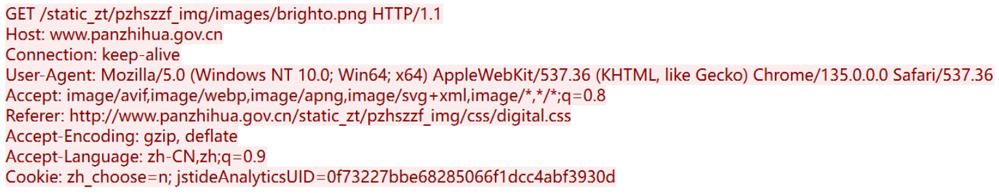
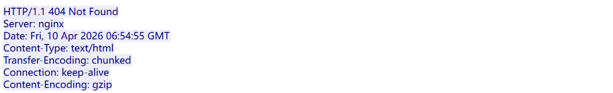

# web介绍

## 项目架构

C/S架构：C表示Client（客户端），S表示Server（服务端）。即客户端和服务端互相通信。

B/S架构：B表示Browser（浏览器），S表示Server（服务端）。即浏览器和服务端互相通信。浏览器也可以称为客户端，是网页的载体。


## HTTP协议

HTTP，超文本传输协议 （Hyper Text Transfer Protocol）。HTTP是一种使用非常广泛的用于分布式、协作式和超媒体信息系统的应用层协议，是万维网数据通信的基础。

http协议规定了客户端与服务端通信数据包的格式。

### 请求数据包



```shell
#请求行
GET /static_zt/pzhszzf_img/images/brighto.png HTTP/1.1  
#请求方式 请求路径 请求协议/协议版本

#请求头键值对
Host: www.panzhihua.gov.cn   
Connection: keep-alive
User-Agent: Mozilla/5.0 (Windows NT 10.0; Win64; x64) AppleWebKit/537.36 (KHTML, like Gecko) Chrome/135.0.0.0 Safari/537.36
Accept: image/avif,image/webp,image/apng,image/svg+xml,image/*,*/*;q=0.8
Referer: http://www.panzhihua.gov.cn/static_zt/pzhszzf_img/css/digital.css
Accept-Encoding: gzip, deflate
Accept-Language: zh-CN,zh;q=0.9
Cookie: zh_choose=n; jstideAnalyticsUID=0f73227bbe68285066f1dcc4abf3930d
        #空行
.sy_fc{position:fixed; right···  #请求数据
```


#### 请求头

```shell
*Accept：客户端接收的文件类型，带有“*/*”则表示接受任何类型的文件
*Referer：当前请求来自哪个网址（URL），服务端可以利用这个值防盗链
*User-Agent：客户端代理信息，例如系统类型，浏览器类型等
*Host：请求目标域名或IP
*X_FORWARDED_FOR：通过代理连接到服务端的客户端真实IP
*Content-Type：本次请求携带的数据格式
*Content-Length：本次请求携带数据主体的长度（单位为字节）
*Transfer-Encoding:chunked：忽略“Content-Length”字段并基于长连接分块发送数据
*Cookie：身份认证
```


### 响应数据包



```shell
#响应行
HTTP/1.1 404 Not Found  
#响应协议/协议版本 响应状态码 对响应状态码的解释

#响应头键值对
Server: nginx
Date: Fri, 10 Apr 2026 06:54:55 GMT
Content-Type: text/html
Transfer-Encoding: chunked
Connection: keep-alive
Content-Encoding: gzip
                                 #空行
.sy_fc{position:fixed; right···  #响应数据
```


#### 响应头

```shell
Date：服务器发送响应时的服务器时间
server:服务器信息，如中间件版本
X-Powered-By：由语言解释器输出，告知客户端数据时由何种语言编写
Cache-Control:是否将响应数据缓存到本地，在一个时间范围内使用本地缓存
Expires：作用与Cache-Control一致	
Pragma：作用与Cache-Control一致，兼容HTTP/1.0
Connection：连接状态，本次响应完成后是否断开连接
Content-Type：响应文件类型及编码
Content-Length：响应文件大小（单位为字节）
Set-Cookie：服务端给客户端发送随机字符串用于身份认证
Strict-Transport-Security：只能通过https访问资源，禁止HTTP访问方式
```


## HTTPS协议

HTTPS协议是对HTTP协议传输数据的一种加密，HTTP协议是通过明文传输数据的，有被窃听的风险。

HTTPS加密方式分为SSL和TLS两种。

### HTTPS加密机制

1.公司自己生成一对**公钥**和**私钥**。

2.公司将**网站基本信息 + 自身公钥**上传给 CA 机构，申请数字证书。

3.CA 机构收到信息后，使用指定**哈希算法**，把公司上传的所有信息计算成一段散列值。

4.CA 机构用**自己的私钥**对这段散列值进行加密，生成**证书签名**，并颁发最终证书给公司。

5.用户（客户端）访问服务端时，服务端返回：**随机数 S、数字证书**。

6.客户端拿到证书后，先查看证书上标明的**签发 CA 机构**。

7.客户端在本地**受信任根证书列表**中查找该 CA 机构对应的公钥，如果能找到，说明证书颁发机构可信。

8.客户端使用 CA 公钥**解密证书中的签名**，得到原始哈希值。

9.客户端按照证书中标明的哈希算法，对**证书里的其他信息**重新计算哈希，得到新的哈希值。

10.客户端对比：解密出来的哈希值 和 自己重新计算的哈希值。如果一致，说明证书内容未被篡改、完整可信。

11.证书验证通过后，客户端把自己支持的**加密套件、对称加密算法、哈希算法**列表发送给服务端。

12.服务端从客户端发来的算法列表中，选择一套**安全性高、效率高**的方案，返回给客户端确认。

13.客户端生成一个随机字符串：**pre master secret**。

14.客户端根据双方协商好的算法，对pre master secret、客户端随机数 C、服务端随机数 S进行加密得到对称加密密钥**secret key**。

15.客户端使用**服务端证书中的公钥**，对 pre master secret 进行非对称加密，发送给服务端。

16.服务端收到密文后，用**自己的私钥**解密，得到原始的 pre master secret。

17.服务端使用同样的协商算法，对pre master secret、客户端随机数 C、服务端随机数 S加密得出**和客户端完全相同的对称加密密钥**。

18.后续客户端与服务端的所有通信数据，都使用这个**共同算出的对称密钥**进行加密和解密。


## HTML

HTML,超文本标记语言（Hyper Text Markup Language）。用来编写网页大致结构。html页面是静态网页，不产生动态数据。


## 前后端分离项目

客户端访问网站时，服务端响应带有js代码的html文件。客户端自上而下解析代码，遇到js代码写的”需要展示什么数据“时，向服务端请求响应的数据。方便管理，用户体验较好。


## 前后端未分离项目

客户端访问网站时，服务端响应php文件。前端代码和后端代码都写在一起，服务端需要把整个页面的数据加工好以后再返回客户端。不方便管理，用户体验较差。