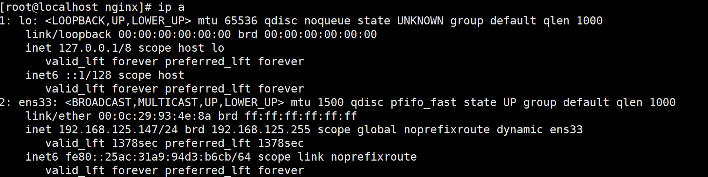

# nginx

## nginx安装


```shell
yum install nginx -y  #安装指令
nginx -v  #查看版本，显示版本号代表安装成功
```


## nginx配置

```shell
vim /etc/nginx/nginx.conf  #nginx配置文件
grep -Ev '#|^$' nginx.conf.default > nginx.conf  
#从默认备份配置文件中过滤掉注释和空行部分，覆盖掉nginx.conf文件

cat nginx.conf
worker_processes  1;  #覆盖后的nginx.conf
events {
    worker_connections  1024;
}
http {
    include       mime.types;
    default_type  application/octet-stream;
    sendfile        on;
    keepalive_timeout  65;
    server {
        listen       80;
        server_name  localhost;
        location / {
            root   html;
            index  index.html index.htm;
        }
        error_page   500 502 503 504  /50x.html;
        location = /50x.html {
            root   html;
        }
    }
}

vim nginx.conf  #编辑配置文件，删除无用内容，只留必要配置
#删除17-20行（nginx version: nginx/1.20.1）

nginx -t  #检查配置语法
nginx: the configuration file /etc/nginx/nginx.conf syntax is ok  #语法正确
nginx: configuration file /etc/nginx/nginx.conf test is successful

systemctl start nginx #启动nginx
systemctl enable nginx #将nginx设置为自启动
```


## 访问nginx

```shell
ip a  #获取本机（服务端）IP
```



在客户端浏览器输入IP 192.168.125.147，响应为nginx默认界面，nginx安装配置成功

