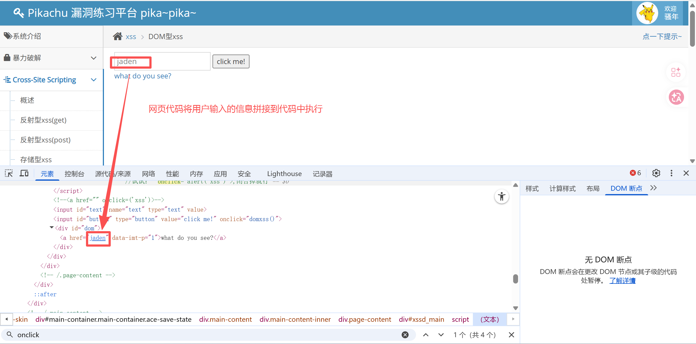
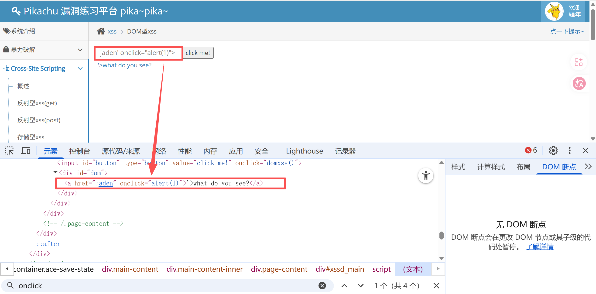
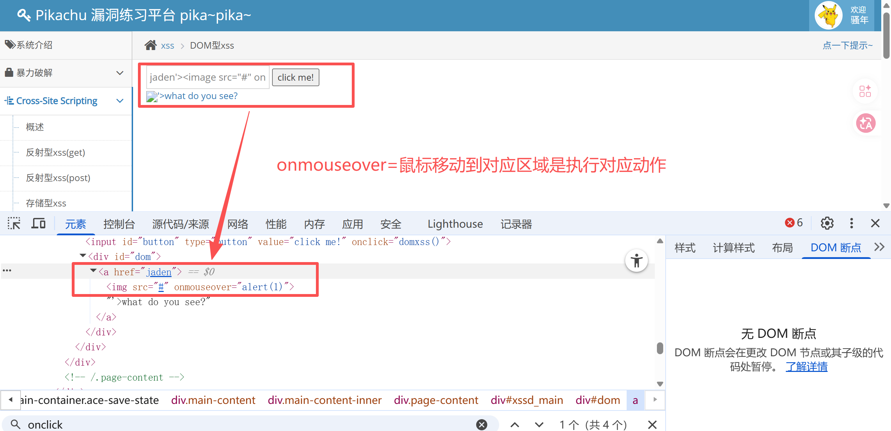
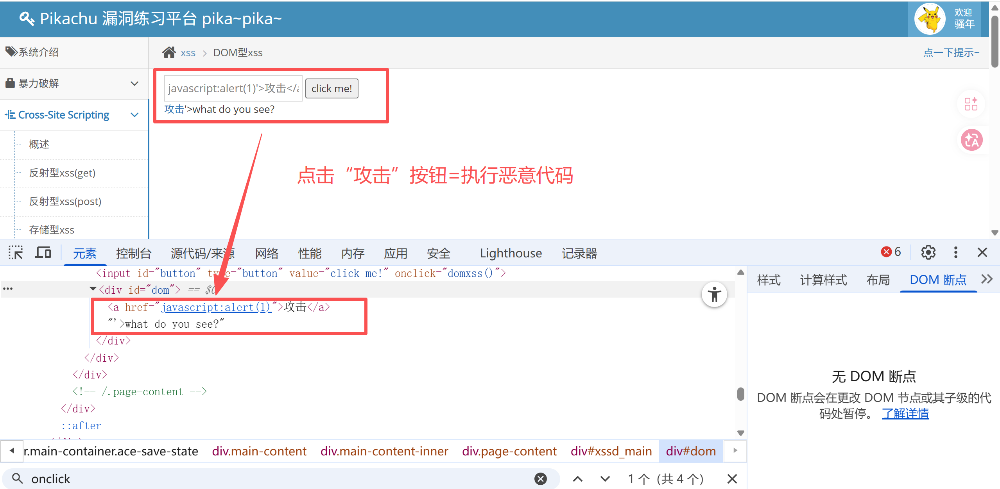

# XSS漏洞

**攻击者的输入被当作HTML结构解析，从而插入并执行脚本逻辑。**


## 分类

- 反射型：注入脚本不被保存到数据库，只具有一次性效果，一般出现在搜索框或者查询点
- 存储型：注入脚本被保存到数据库。在被删除前，任何人每次访问该页面都会重新执行脚本
- DOM型XSS：通过更改客户端HTML代码注入XSS脚本


## DOM型XSS

网页代码将用户提交的信息拼接到代码中执行。攻击者通过控制提交信息，间接控制网页代码，达到反射型XSS注入效果




### onclick

在a标签中添加onclick动作，点击提交按钮=执行恶意代码

```shell
jaden' onclick="alert(1)">
```




### image

在a标签后面添加image标签，鼠标移动到image区域=执行恶意代码

```shell
jaden'><image src="#" onmouseover="alert(1)">
```





### Javascript

将源代码中的href值替换为恶意代码，点击按钮=执行恶意代码

```shell
javascript:alert(1)'>攻击</a>
```




