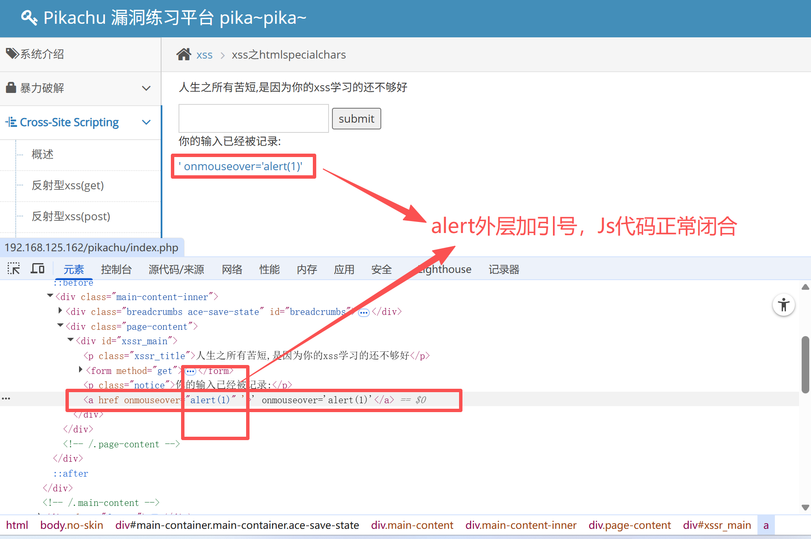
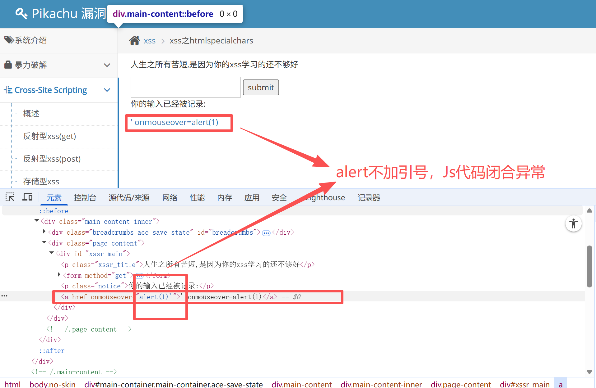

# XSS绕过手段

## 前端绕过

在控制台修改Js代码、从网址栏提交payload、Burp抓包后修改数据包···


## 后端绕过

进行一些测试猜后端代码的过滤逻辑，针对性绕过。列一个payload清单挨个测试

- 双写绕过
- 大小写绕过
- 更换payload标签（script被过滤就换image）


### htmlspecialchars转义

这个函数会把注入payload中特殊符号进行URL编码，使payload失效

对于引号，这个函数默认只编码双引号。所以可以进行测试单引号是否有效

**设置参数控制对引号的编码**

ENT_COMPAT - 默认仅编码双引号
ENT_QUOTES - 编码双引号和单引号
ENT_NOQUOTES - 不编码任何引号


用引号进行测试时

```shell
' onmouseover='alert(1)' 
```

`alert(1)`外层加一层引号和不加引号都试试，浏览器有时候识别不好

**加引号**



**不加引号**




### 编码绕过过滤机制

后端过滤规则基于明文，把payload进行编码后提交，绕过后端过滤规则

XSS漏洞在标签上就用html10进制编码，XSS漏洞在js代码就用JSunicode16进制编码

- html10进制实体编码 `&#97`
- html16进制实体编码 `&#x61`
- Js16进制Unicode 编码 `\u0061`


### HttpOnly绕过

服务端开启HttpOnly之后无法通过document.cookie获取Cookie

#### form表单劫持

通过存储型XSS漏洞制作透明按钮覆盖原登录按钮，点击后自动将信息提交给攻击者

#### 获取浏览器保存的用户名密码

通过存储型XSS漏洞注入恶意脚本，加载后获取信息发给攻击者

#### PHPinfo获取配置信息

站点大概率不存在PHPinfo文件，需要手动上传


## XSS防范

对输入进行过滤，对输出进行编码；白名单过滤比黑名单过滤更有效
